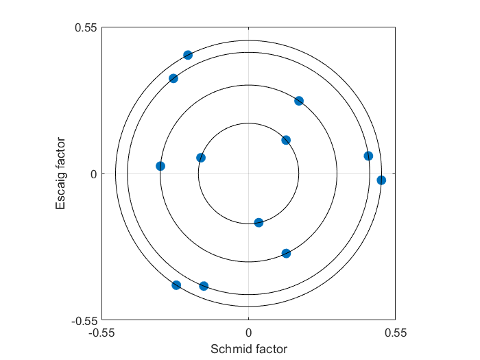
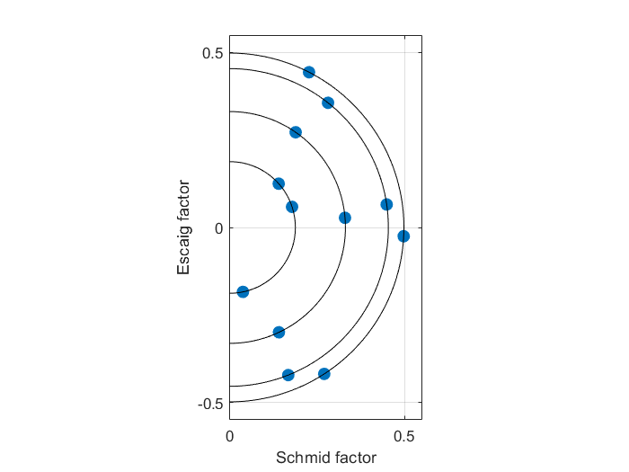
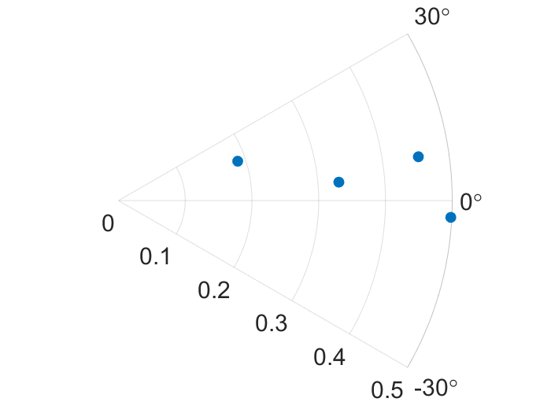
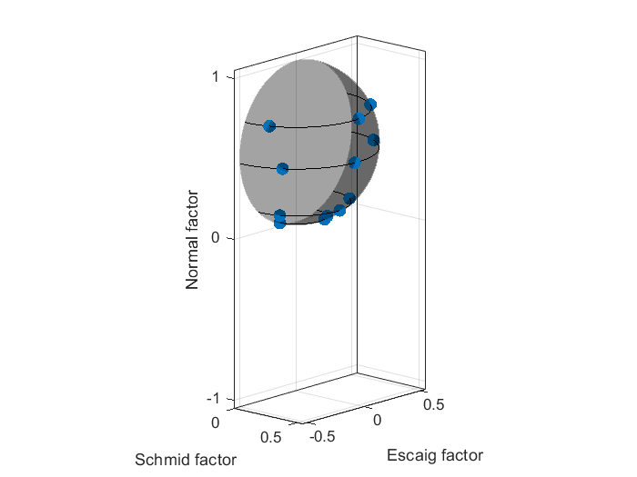

# Stress orientation maps - fcc
Plots of 'stress orientation maps' for face-centred cubic crystals and tables with the relevant data. The derivation and interpretation of this work has been published in: [F.D. León-Cázares and C.M.F. Rae. A stress orientation analysis framework for dislocation glide in face-centred cubic metals. Crystals, 10 (2020) 445](https://www.mdpi.com/2073-4352/10/6/445). Please cite this publication if you benefit from this repository.

## Requirements
Coded in Matlab R2021a. There is no need for additional packages.

## License
This repository is published under a GNU GPL v3 license (). See `LICENSE.txt` for full licensing information.

## How to use

Open the **SOM.m** file and modify the input parameters to your needs. The loading conditions that can be modelled are:
* uniaxial load
* shear of a (111) plane
* arbitrary stress tensors referenced to the crsytal frame of reference
 
All calculations are performed within the **m24.m** function, which outputs the resulting stress states for individual slip systems and for each {111} slip plane. These results are then plotted into four different stress orientation maps:
* mS vs mE

* |mS| vs mE

* tau vs phi \[-30 deg, 30 deg\]

* 3D: |mS| vs mE vs mN

